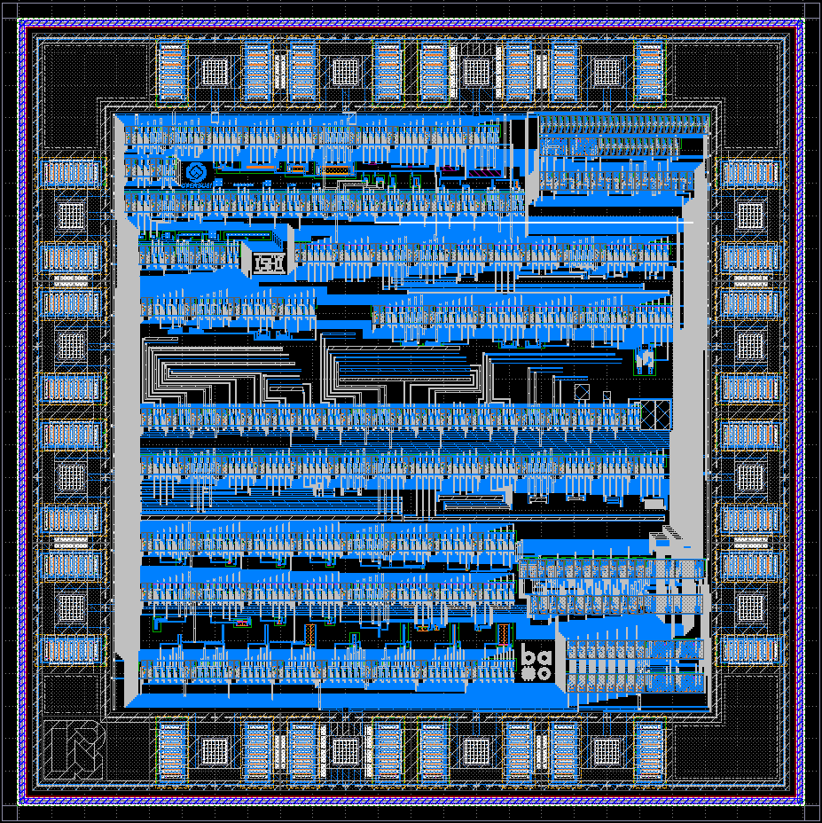

# Address Decoder and Multiplexer for Semiconductor Characterization

## Chip Layout

## Purpose

To implement a large number of circuit functions with a limited number of pins, this chip incorporates an 8-bit address decoder and multiplexer.

By switching between circuits, it can measure MOSFETs, interconnects, resistors, capacitances, junctions, standard cells, and device matching.
However, this chip is not a dedicated TEG (Test Element Group) optimized for high-precision extraction of each parameter.
Therefore, the values obtained should not be treated as official process parameters, but rather as **reference measurements from actual fabricated TR-1um chips**.

Another objective is to use the measurement of this chip to explore how far semiconductor measurement tools, including PCBs and software, can be developed at the community level.

The measurement board for this project will be built around [Baochip](https://baochip.com/), providing the control and interface platform for characterizing the TR-1um test chip.

## Operation

### Addressing

The DUT (Device Under Test) to be measured is selected using an 8-bit address.
Address `A` is divided as follows:

- `A7`..`A4`: `HGx`
- `A3`..`A0`: `LN0` ~ `LN15`

The circuit is selected by the combination of HG and LN.

### Basic Operating Procedure

1. Set `SEL_EN` Low to deselect all DUTs.
2. Supply a 100 kHz clock to `SEL_CLK` while inputting the address from `SEL_CLK` (sampled on the rising edge).
3. After the address has been established, set `SEL_EN` High.
4. Measure the selected DUT.
5. Before changing to the next address, set `SEL_EN` Low again.

## Pinout

| Position | Name | Function |
|---|---|---|
| P1 | `P1_HCUR` | Analog HIGH current / force |
| P2 | `P2_HPOT` | Analog HIGH potential / sense |
| P3 | `FF_ASYNC` | DFF asynchronous SET / RESET control |
| P4 | `P4_LCUR` | Analog LOW current / force |
| P5 | `P5_LPOT` | Analog LOW potential / sense |
| P6 | `P6_BIAS1` | MOS gate / analog bias |
| P7 | `CAL_OPEN` | Unconnected pad/frame parasitic calibration |
| P8 position | `VSS` | Ground |
| P9 | `SEL_CLK` | Address serial-register clock |
| P10 | `SEL_DATA` | Address serial data |
| P11 | `SEL_EN` | DUT selector enable, active high |
| P12 | `EXT_CLK` | External clock for digital DUTs |
| P13 | `DIG_IN` | Digital DUT input |
| P14 | `DIG_OUT` | Selected digital DUT output |
| P15 | `VDD_DUT` | PMOS body / well / DUT bias supply |
| P16 position | `VDD` | Digital logic and selector positive supply |

## Address Map

### 0x01–0x06 : Calibration

| Address | DUT | Purpose |
|---|---|---|
| `0x01` | `CAL_KELVIN_OPEN` | 4-wire measurement open reference |
| `0x02` | `CAL_KELVIN_SHORT` | 4-wire measurement short reference |
| `0x03` | `CAL_CAP_OPEN` | Capacitance measurement open reference |
| `0x04` | `CAL_LEAK_OPEN` | Leakage measurement open reference |
| `0x05` | `CAL_DIG_THRU` | Direct digital input→output reference |
| `0x06` | `CAL_SELECTOR_PARASITIC` | Analog selector parasitic reference |

For `CAL_DIG_THRU`, the signal applied at P13 passes through the reference path and is output at P14 through the digital output mux.

---

### 0x20–0x37 : INTERCONNECT_R

Measures the resistance of M1, M2, contacts, V1, and related interconnect structures.
Measurements are generally performed as 4-wire measurements using P1/P2/P4/P5.

| Address | DUT |
|---|---|
| `0x20` | `R_CO_CHAIN_10` |
| `0x21` | `R_CO_CHAIN_100` |
| `0x22` | `R_M2_W12_L50` |
| `0x23` | `R_M2_W12_L200` |
| `0x24` | `R_M2_W12_L800` |
| `0x25` | `R_M1_W7.2_L50` |
| `0x26` | `R_M1_W7.2_L200` |
| `0x27` | `R_M1_W7.2_L800` |
| `0x28` | `R_M2_W3_L50` |
| `0x29` | `R_M2_W3_L200` |
| `0x2A` | `R_M2_W3_L800` |
| `0x2B` | `R_M1_W1.8_L50` |
| `0x2C` | `R_M1_W1.8_L200` |
| `0x2D` | `R_M1_W1.8_L800` |
| `0x2E` | `R_LOCAL_OPEN` |
| `0x2F` | `R_LOCAL_SHORT` |
| `0x30` | `R_V1_CHAIN_10` |
| `0x31` | `R_V1_CHAIN_100` |
| `0x32` | `R_M2_W6_L50` |
| `0x33` | `R_M2_W6_L200` |
| `0x34` | `R_M2_W6_L800` |
| `0x35` | `R_M1_W3.6_L50` |
| `0x36` | `R_M1_W3.6_L200` |
| `0x37` | `R_M1_W3.6_L800` |

`R_CO_CHAIN_*` is a structure in which many contacts are connected in series to make contact resistance easier to measure, while `R_V1_CHAIN_*` similarly connects many M1–M2 vias in series to measure via resistance.

`R_LOCAL_OPEN` and `R_LOCAL_SHORT` are references for evaluating parasitic and series resistance introduced by the selector and local routing.

---

### 0x40–0x59 : INTERCONNECT_C

Measures capacitance between interconnects and the substrate, between different metal layers, and between wires on the same metal layer.

These are 2-terminal structures and generally use P1/P4.

| Address | DUT |
|---|---|
| `0x40` | `C_LOCAL_OPEN` |
| `0x41` | `C_M1_SUB_W1.8_L100` |
| `0x42` | `C_M1_SUB_W1.8_L400` |
| `0x43` | `C_M1_SUB_W3.6_L100` |
| `0x44` | `C_M1_SUB_W3.6_L400` |
| `0x45` | `C_M1_SUB_W7.2_L100` |
| `0x46` | `C_M1_SUB_W7.2_L400` |
| `0x47` | `C_M2_SUB_W3_L100` |
| `0x48` | `C_M2_SUB_W3_L400` |
| `0x49` | `C_M2_SUB_W6_L100` |
| `0x50` | `C_M2_SUB_W6_L400` |
| `0x51` | `C_M2_SUB_W12_L100` |
| `0x52` | `C_M2_SUB_W12_L400` |
| `0x53` | `C_M1M2_OVERLAP_22.5` |
| `0x54` | `C_M1M2_OVERLAP_45` |
| `0x55` | `C_M1M2_OVERLAP_90` |
| `0x56` | `C_M1_COUP_W1.8_S1.4_L400` |
| `0x57` | `C_M1_COUP_W1.8_S3_L400` |
| `0x58` | `C_M2_COUP_W3_S2_L400` |
| `0x59` | `C_M2_COUP_W3_S4_L400` |

The `SUB` structures measure the effective capacitance between an interconnect and the substrate (`p_cont`).

The `OVERLAP` structures place M1 and M2 directly above and below each other to measure M1–M2 capacitance.

The `COUP` structures define the width W, edge-to-edge spacing S, and parallel length L of two parallel interconnects in order to measure lateral coupling capacitance.

`C_LOCAL_OPEN` is a capacitance reference containing only the selector and local interconnect.

---

### 0x60–0x77 : MOS_DC

Measures MOSFET DC I-V characteristics and their dependence on W/L.

For NMOS devices, the body is fixed to VSS.

For PMOS devices, the body / N-well is controlled through P15.

#### NMOS

| Address | DUT |
|---|---|
| `0x60` | `NMOS_DC_W3.4_L1` |
| `0x61` | `NMOS_DC_W10_L1` |
| `0x62` | `NMOS_DC_W30_L1` |
| `0x63` | `NMOS_DC_W60_L1` |
| `0x64` | `NMOS_DC_W10_L2` |
| `0x65` | `NMOS_DC_W10_L5` |
| `0x66` | `NMOS_DC_W10_L10` |
| `0x67` | `NMOS_DC_W10_L30` |
| `0x68` | `NMOS_DC_W3.4_L5` |
| `0x69` | `NMOS_DC_W30_L5` |
| `0x6A` | `NMOS_DC_W60_L5` |
| `0x6B` | `NMOS_DC_W60_L30` |

#### PMOS

| Address | DUT |
|---|---|
| `0x6C` | `PMOS_DC_W3.4_L1` |
| `0x6D` | `PMOS_DC_W10_L1` |
| `0x6E` | `PMOS_DC_W30_L1` |
| `0x6F` | `PMOS_DC_W60_L1` |
| `0x70` | `PMOS_DC_W10_L2` |
| `0x71` | `PMOS_DC_W10_L5` |
| `0x72` | `PMOS_DC_W10_L10` |
| `0x73` | `PMOS_DC_W10_L30` |
| `0x74` | `PMOS_DC_W3.4_L5` |
| `0x75` | `PMOS_DC_W30_L5` |
| `0x76` | `PMOS_DC_W60_L5` |
| `0x77` | `PMOS_DC_W60_L30` |

By using P1/P2 and P4/P5 for each MOS device, measurements can separate the voltage drop introduced by the selector and global wiring.

---

### 0x80–0x93 : MOS_JUNCTION_C

Measures MOS gate capacitance and diffusion / well junction capacitance.

#### MOS Gate Capacitance

| Address | DUT |
|---|---|
| `0x80` | `C_NMOS_WG20_L10_N1` |
| `0x81` | `C_NMOS_WG20_L10_N2` |
| `0x82` | `C_NMOS_WG20_L10_N4` |
| `0x83` | `C_NMOS_WG20_L10_N8` |
| `0x84` | `C_PMOS_WG20_L10_N1` |
| `0x85` | `C_PMOS_WG20_L10_N2` |
| `0x86` | `C_PMOS_WG20_L10_N4` |
| `0x87` | `C_PMOS_WG20_L10_N8` |

By varying the number of parallel units with N1/N2/N4/N8, the area dependence of capacitance can be separated from measurement-system parasitics.

#### N+ / P-Substrate Junction

| Address | DUT |
|---|---|
| `0x88` | `C_JUNC_NPLUS_PSUB_SQ_N1` |
| `0x89` | `C_JUNC_NPLUS_PSUB_SQ_N2` |
| `0x8A` | `C_JUNC_NPLUS_PSUB_SQ_N4` |
| `0x8B` | `C_JUNC_NPLUS_PSUB_RECT_N1` |
| `0x8C` | `C_JUNC_NPLUS_PSUB_RECT_N2` |
| `0x8D` | `C_JUNC_NPLUS_PSUB_RECT_N4` |

#### P+ / N-Well Junction

| Address | DUT |
|---|---|
| `0x8E` | `C_JUNC_PPLUS_NWELL_SQ_N1` |
| `0x8F` | `C_JUNC_PPLUS_NWELL_SQ_N2` |
| `0x90` | `C_JUNC_PPLUS_NWELL_SQ_N4` |
| `0x91` | `C_JUNC_PPLUS_NWELL_RECT_N1` |
| `0x92` | `C_JUNC_PPLUS_NWELL_RECT_N2` |
| `0x93` | `C_JUNC_PPLUS_NWELL_RECT_N4` |

By comparing SQ and RECT structures, as well as N1/N2/N4, the area and perimeter components of junction capacitance can be evaluated.

---

### 0xA0–0xA3 / 0xB0–0xB5 : MATCHING

Each physical DUT consists of four unit MOS devices.

Members A and B each consist of two unit MOS devices connected in parallel, and A and B are measured at separate addresses.

#### NMOS

| Address | DUT / member |
|---|---|
| `0xA0` | `MATCH_NMOS_W10_L1_ADJACENT` member A |
| `0xA1` | `MATCH_NMOS_W10_L1_ADJACENT` member B |
| `0xA2` | `MATCH_NMOS_W30_L5_ADJACENT` member A |
| `0xA3` | `MATCH_NMOS_W30_L5_ADJACENT` member B |

The W10/L1 DUT consists of four W5/L1 units. Each member connects two W5/L1 units in parallel, giving an effective W10/L1.

The W30/L5 DUT consists of four W15/L5 units. Each member therefore has an effective W30/L5.

The NMOS body is fixed to VSS.

#### PMOS

| Address | DUT / member |
|---|---|
| `0xB0` | `MATCH_PMOS_W10_L1_ADJACENT` member A |
| `0xB1` | `MATCH_PMOS_W10_L1_ADJACENT` member B |
| `0xB2` | `MATCH_PMOS_W30_L5_ADJACENT` member A |
| `0xB3` | `MATCH_PMOS_W30_L5_ADJACENT` member B |
| `0xB4` | `MATCH_PMOS_W30_L5_COMMON_CENTROID` member A |
| `0xB5` | `MATCH_PMOS_W30_L5_COMMON_CENTROID` member B |

For the PMOS W30/L5 COMMON_CENTROID structure, A and B are placed diagonally so that the geometric centroids of A and B coincide.

This allows comparison between:

- random mismatch + spatial gradient observed with the ADJACENT layout
- a condition in which the spatial gradient is suppressed by the COMMON_CENTROID layout

The PMOS N-well / body is connected to P15.

---

### 0xC0–0xC7 : Passive Resistors

Measures TR-1um passive resistor structures using 4-wire measurements.

| Address | DUT |
|---|---|
| `0xC0` | `RR_W2p8_L13` |
| `0xC1` | `RR_W2p8_L100` |
| `0xC2` | `RR_W10_L50` |
| `0xC3` | `RR_W20_L100` |
| `0xC4` | `RS_W4_L20` |
| `0xC5` | `RS_W4_L100` |
| `0xC6` | `RS_W10_L50` |
| `0xC7` | `RS_W20_L100` |

By varying width and length, sheet resistance, contact contribution, and geometry dependence can be evaluated.

---

### 0xD0–0xD5 : Digital Standard-Cell Characterization

P13 is used as the digital input and P14 as the selected digital output.

#### Inverter Chains

| Address | DUT |
|---|---|
| `0xD0` | `INV_CHAIN_1` |
| `0xD1` | `INV_CHAIN_3` |
| `0xD2` | `INV_CHAIN_9` |
| `0xD3` | `INV_CHAIN_27` |

By varying the number of inverter stages, the following can be evaluated on actual silicon:

- propagation delay
- stage delay
- rise/fall behavior
- load accumulation

`0x05 CAL_DIG_THRU` can be used as a reference for input/output routing delay.

#### Flip-Flops

| Address | DUT |
|---|---|
| `0xD4` | `DFFS` |
| `0xD5` | `DFFR` |

For the DFF measurements:

- P12 = clock
- P13 = D
- P14 = Q
- P3 = asynchronous control

For `DFFS`, asynchronous SET becomes active when P3 `FF_ASYNC` is LOW, forcing Q=1. During normal operation, P3 should be held HIGH.

For `DFFR`, asynchronous RESET becomes active when P3 `FF_ASYNC` is HIGH, forcing Q=0. During normal operation, P3 should be held LOW.

These structures can be used to measure:

- setup time
- hold time
- clock-to-Q delay
- asynchronous SET / RESET delay
- recovery time
- removal time

## Operating Principle

Each DUT is paired with one **ASEL**.
The ASEL connects only the DUT selected by the address to the external pins.

| ASEL | External Pin | Function |
|---|---|---|
| `ASEL_2T` | `P1`, `P4` | 2-terminal measurements such as capacitance and junction measurements |
| `ASEL_4T` | `P1`, `P2`, `P4`, `P5` | 4-wire / Kelvin measurements such as resistance measurements |
| `ASEL_5T` | `P1`, `P2`, `P4`, `P5`, `P6` | NMOS measurement |
| `ASEL_6T` | `P1`, `P2`, `P4`, `P5`, `P6`, `P15` | PMOW measurement (`ASEL_5T` + body-control terminal) |
